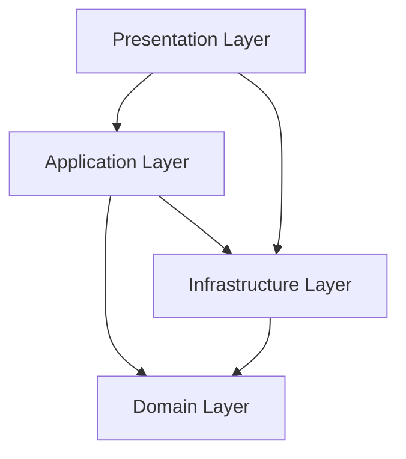
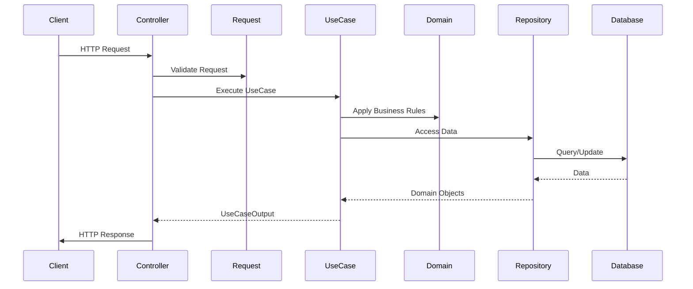
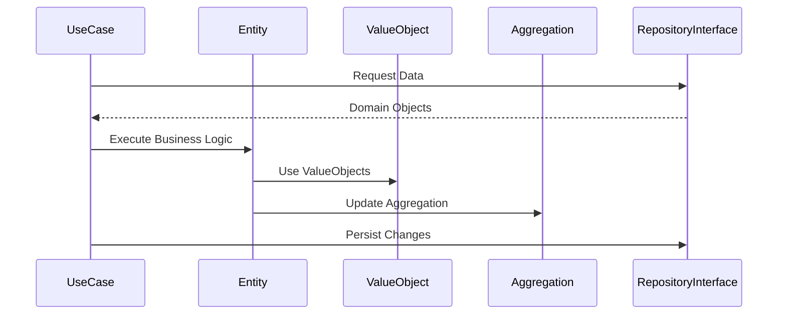

# System Patterns: Rex

## Architecture Overview

Rexはクリーンアーキテクチャの原則を実装し、コードベースを明確な責任と依存関係を持つ異なるレイヤーに整理しています。このアーキテクチャにより、ビジネスルールがフレームワーク、データベース、UIから独立していることを保証し、システムをより保守しやすく、テストしやすくしています。

## Layer Structure

### Domain Layer
アプリケーションのコアであり、ビジネスエンティティとルールを含みます。

- **ValueObjects**: アイデンティティを持たない概念を表す不変オブジェクト
- **Entities**: アイデンティティとライフサイクルを持つオブジェクト
- **Aggregations**: 単位として扱われるドメインオブジェクトのクラスター
- **RepositoryInterfaces**: データアクセスのための契約

### Application Layer
データフローを調整し、高レベルのビジネス操作を調整します。

- **UseCases**: 特定のビジネス操作の実装
  - **UseCaseInput**: ユースケース入力のためのデータ転送オブジェクト
  - **UseCaseOutput**: ユースケース結果のためのデータ転送オブジェクト
  - **UseCaseQueryServiceInterface**: 特殊なクエリのための契約

### Presentation Layer
ユーザーインタラクションを処理し、表示用にデータをフォーマットします。

- **Api**: APIエンドポイントのコンポーネント
  - **Controllers**: HTTPリクエストとレスポンスを処理
  - **Requests**: 入力データを検証
  - **Responders**: レスポンス用にデータをフォーマット

### Infrastructure Layer
ドメインレイヤーで定義されたインターフェースの実装を提供します。

- **Models**: Laravel Eloquentモデル
  - **Factories**: テスト用のモデルインスタンスを作成
- **Repositories**: ドメインリポジトリインターフェースの実装
- **QueryServices**: 特殊なクエリの実装

### Framework Layer
フレームワーク固有のコンポーネントを含みます。

- **ServiceProviders**: Laravelサービスプロバイダー
- **Middlewares**: HTTPミドルウェアコンポーネント

## Key Design Patterns

### Repository Pattern
- データアクセスロジックを抽象化
- ドメインオブジェクトのためのコレクションのようなインターフェースを提供
- ドメインをデータストレージメカニズムから分離

### Factory Pattern
- 複雑なオブジェクトを作成
- オブジェクト作成ロジックを分離
- 主にテストで使用

### Use Case Pattern
- ビジネス操作をカプセル化
- 明確な入出力境界を定義
- 単一責任の原則を維持

### Dependency Inversion
- 高レベルモジュールは低レベルモジュールに依存しない
- 両方が抽象化に依存
- インターフェースと依存性注入を通じて実装

## Component Relationships

### Dependency Rules
- 外側のレイヤーは内側のレイヤーに依存できるが、その逆はできない
- ドメインレイヤーは他のレイヤーに依存しない
- アプリケーションレイヤーはドメインレイヤーにのみ依存
- プレゼンテーションレイヤーとインフラストラクチャレイヤーはアプリケーションレイヤーとドメインレイヤーに依存できる

### Data Flow
1. **リクエストフロー**: HTTPリクエスト → コントローラー → ユースケース → ドメインロジック → リポジトリ → データベース
2. **レスポンスフロー**: データベース → リポジトリ → ドメインオブジェクト → ユースケース → レスポンダー → HTTPレスポンス

## Critical Implementation Paths

### API Request Handling

### Domain Logic Execution

