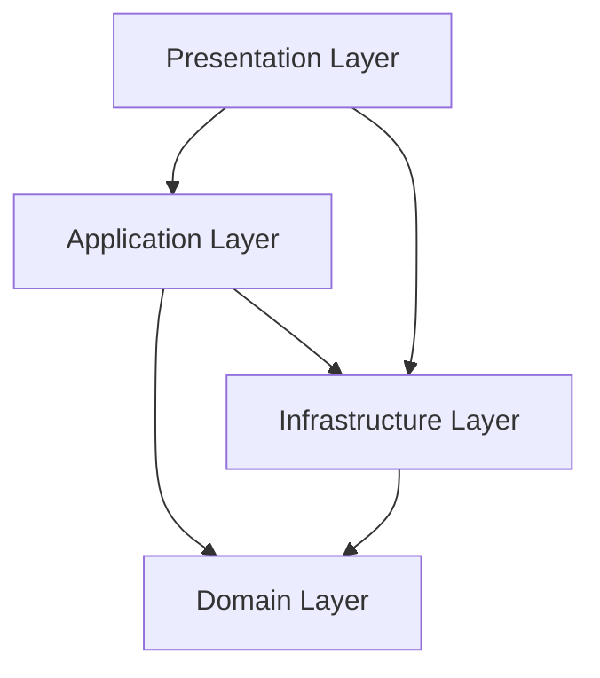
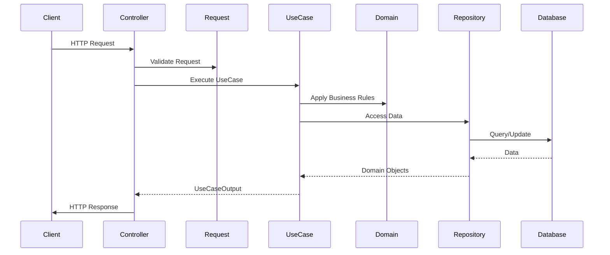
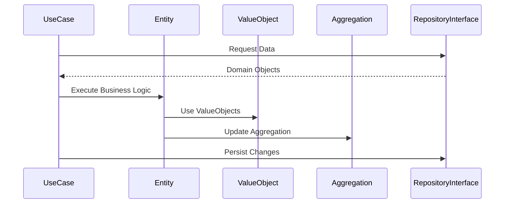

# System Patterns: Rex

## Architecture Overview

Rex implements Clean Architecture principles, organizing the codebase into distinct layers with clear responsibilities and dependencies. The architecture ensures that business rules are independent of frameworks, databases, and UI, making the system more maintainable and testable.

## Layer Structure

### Domain Layer
The core of the application containing business entities and rules.

- **ValueObjects**: Immutable objects representing concepts with no identity
- **Entities**: Objects with identity and lifecycle
- **Aggregations**: Clusters of domain objects treated as a unit
- **RepositoryInterfaces**: Contracts for data access

### Application Layer
Orchestrates the flow of data and coordinates high-level business operations.

- **UseCases**: Implementation of specific business operations
  - **UseCaseInput**: Data transfer objects for use case input
  - **UseCaseOutput**: Data transfer objects for use case results
  - **UseCaseQueryServiceInterface**: Contracts for specialized queries

### Presentation Layer
Handles user interaction and formats data for display.

- **Api**: Components for API endpoints
  - **Controllers**: Handle HTTP requests and responses
  - **Requests**: Validate incoming data
  - **Responders**: Format data for response

### Infrastructure Layer
Provides implementations for interfaces defined in the domain layer.

- **Models**: Laravel Eloquent models
  - **Factories**: Create model instances for testing
- **Repositories**: Implementations of domain repository interfaces
- **QueryServices**: Specialized query implementations

### Framework Layer
Contains framework-specific components.

- **ServiceProviders**: Laravel service providers
- **Middlewares**: HTTP middleware components

## Key Design Patterns

### Repository Pattern
- Abstracts data access logic
- Provides a collection-like interface for domain objects
- Decouples domain from data storage mechanisms

### Factory Pattern
- Creates complex objects
- Isolates object creation logic
- Used primarily in testing

### Use Case Pattern
- Encapsulates business operations
- Defines clear input/output boundaries
- Maintains single responsibility principle

### Dependency Inversion
- High-level modules don't depend on low-level modules
- Both depend on abstractions
- Implemented through interfaces and dependency injection

## Component Relationships

### Dependency Rules
- Outer layers can depend on inner layers, but not vice versa
- Domain layer has no dependencies on other layers
- Application layer depends only on Domain layer
- Presentation and Infrastructure layers can depend on Application and Domain layers

### Data Flow
1. **Request Flow**: HTTP Request → Controller → UseCase → Domain Logic → Repository → Database
2. **Response Flow**: Database → Repository → Domain Objects → UseCase → Responder → HTTP Response

## Critical Implementation Paths

### API Request Handling

### Domain Logic Execution

